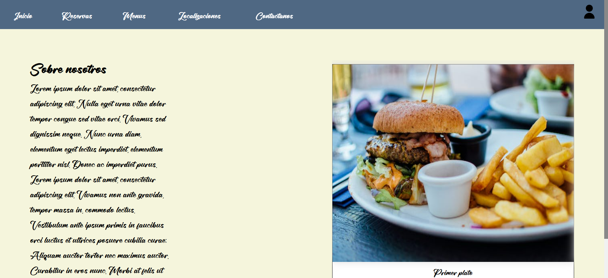
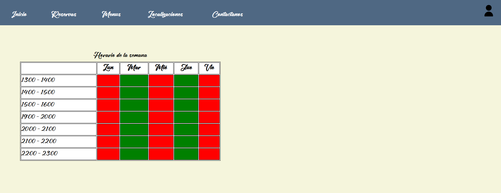
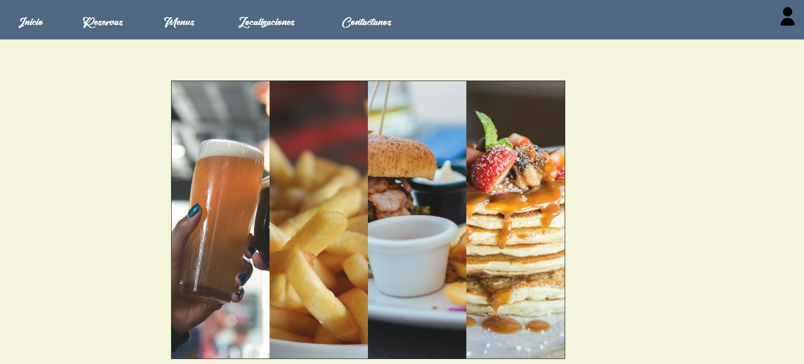
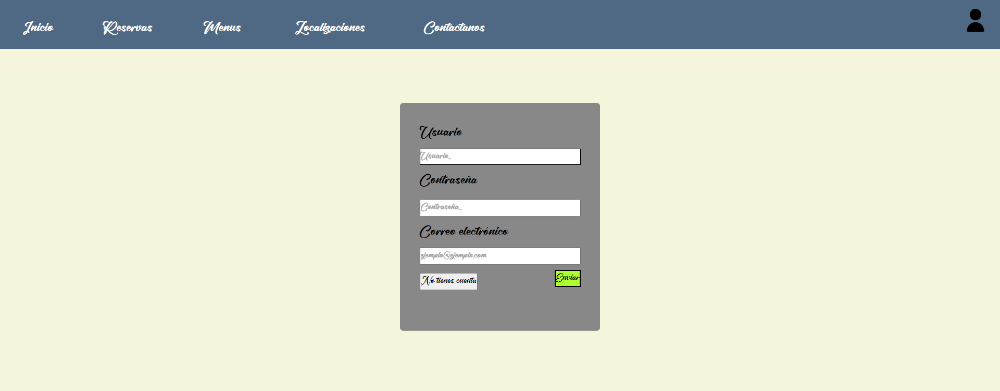
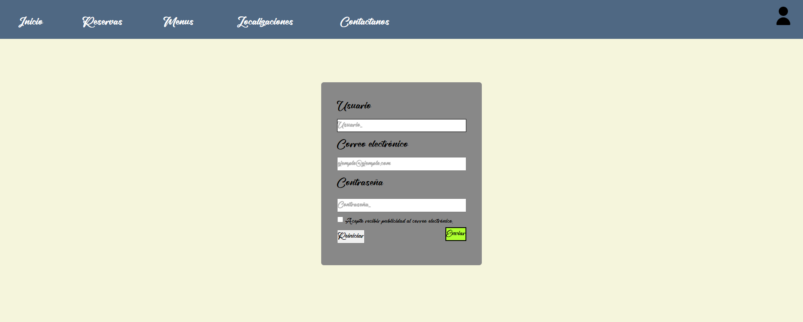

# Restaurante Paco
Ésta práctia consiste en elaborar una página web utilizando los conocimientos adquiridos de HTML y CSS.

Yo he decidido hacer una página web sobre un restaurante. Utilizo vaerios archivos html y un archivo css que aplica los estilos necesarios para la página web.

## Explicación del código

En todos los archivos html tengo creadas dos barras de navegación. Una horizontal y otra vertical que también es ocultable.

### Index.html
En esta página tengo un section con un pequeño texto y un carrusel de imágenes que van cambiando automáticamente con una animación.

### Reservas.html
Muestro una tabla que muestra los días de la semana en los que es posible hacer reservas. Tiene un hover que cambia el color de la casilla según el usuario pase el cursor por encima.

### Menu.html
Aquí muestro una galería de imagenes con la característica object-fit que muestran fotos del menu.

### Login.html y register.html
Muestro un formulario para que el usuario inicie sesión (login.html) y si no tiene cuenta, tiene un botón que le manda a register.html.

### Estilos.css
En este archivo css añado todos los estilos necesarios para los archivos html.

Varios ejemplos de lo que los elementos a los que dan estilo son: 
- Añado una nueva fuente que tengo guardada en una carpeta dentro del proyecto.
- Creo dos media queries (min-width: 600px y max-width: 600px) donde configuro el tamaño de las columnas del grid que utilizo en los elementos del trabajo
- Le doy estilo a las dos galerias de imagenes y más cosas que se ven reflejadas en la página web.
